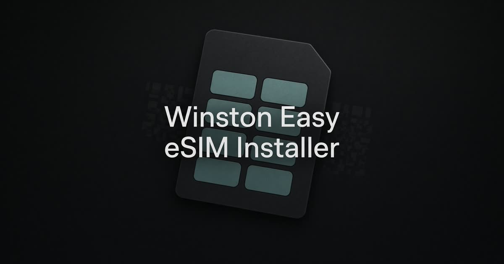

# Winston Easy eSIM Installer

<p align="center">
  
</p>

I kept getting stuck trying to scan an eSIM QR that was already on my phone. So I made this.

Drop the QR in (or paste the code), and it becomes a link you open on the phone that needs the plan. Tap install. iPhone or Android does the rest.

## What it does

- Reads an eSIM profile from a QR screenshot, a camera scan, a pasted LPA string, an Apple/Android install URL, or the SM-DP+ address plus activation code
- Builds a one-tap install link for iPhone (iOS 17.4+) and Android (10+ with Google services)
- Gives you a shareable page with the same profile in the URL — nothing is stored on a server
- Keeps the QR and the two codes on screen if one-tap fails

Your QR never leaves the browser. I only build the link. The install itself is handled by iOS or Android.

The phone has to be unlocked and actually support eSIM.

## Use it

1. Put the QR in — a screenshot from the carrier email is fine
2. Open the link on the phone that needs data
3. Tap **Install on iPhone** or **Install on Android**

If the buttons fail, scan the on-screen QR in Settings → Add eSIM, or copy the SM-DP+ address and activation code.

There is a sample profile in the app if you just want to see the flow.

## Run locally

```bash
npm install
npm run dev
```

Then open [http://127.0.0.1:5173](http://127.0.0.1:5173).

```bash
npm run build      # production build
npm run typecheck  # TypeScript
```

## Stack

React, TanStack Start, Vite, and Tailwind. Profiles stay in the page and in `localStorage` for recent history — there is no backend database.

---

Made by Winston.
